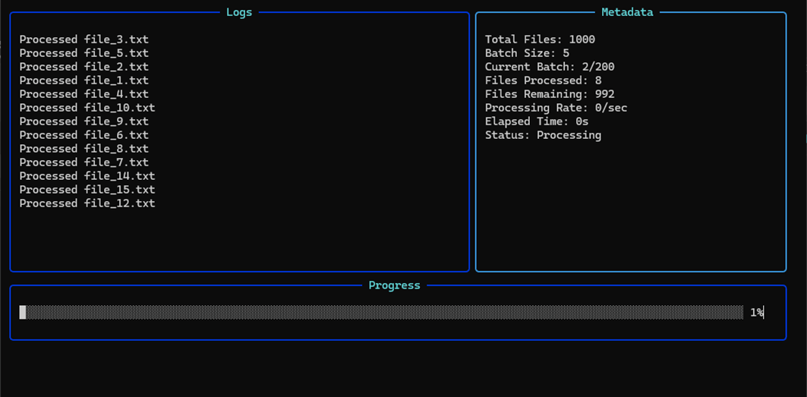

<div align="center">


</div>

> A modern TypeScript library for building organized, dynamic terminal interfaces with zone-based layouts

[](https://badge.fury.io/js/zonr)
[](https://opensource.org/licenses/MIT)
[](https://nodejs.org/)

---



Zonr transforms terminal output from chaotic text streams into organized, responsive interfaces. Create dashboards, build tools, monitoring systems, and interactive applications with intuitive zone-based layouts that adapt to your terminal size.

---

## ✨ Key Features

- **🎯 Zone-Based Architecture**: Organize output into distinct, configurable areas
- **📐 Dynamic Layout System**: Automatic row grouping with intelligent space distribution  
- **📱 Responsive Design**: Zones adapt automatically to terminal size changes
- **⚡ Real-Time Updates**: Event-driven messaging for instant UI updates
- **🎨 Customizable Styling**: Configurable borders, colors, headers, and dimensions
- **🔧 Perfect Alignment**: Custom ANSI renderer ensures pixel-perfect borders
- **🌍 Wide Character Support**: Proper handling of emoji and Unicode characters
- **🚀 High Performance**: Differential rendering updates only changed content
- **🪟 Cross-Platform**: Full Windows support with resize detection workarounds
- **📁 File Transport**: High-performance logging with sonic-boom and automatic cleanup
- **🛡️ Signal Handling**: Automatic graceful shutdown with transport flushing on SIGINT/SIGTERM

---

## 📦 Installation

```bash
npm install @zonr-logs/core
# or
pnpm add @zonr-logs/core  
# or
yarn add @zonr-logs/core
```

**Requirements:** Node.js ≥16

---

## 🎮 Quick Start

```typescript
import Zonr, { FileTransport } from '@zonr-logs/core';

// Create a new terminal UI with automatic signal handling
const zonr = new Zonr({ autoCleanup: true });

// Add zones with different layouts and file logging
const logs = zonr.addZone({
  name: "Application Logs",
  width: "70%",
  height: "auto", 
  borderColor: "blue",
  additionalTransports: [
    new FileTransport({
      filePath: "./app.log",
      highVolume: true  // Optimized for high-throughput logging
    })
  ]
});

const status = zonr.addZone({
  name: "System Status",
  width: "30%", 
  height: "auto",
  borderColor: "green"
});

// Start logging - automatically flushes to file on exit
logs.info('🚀 Application started');
logs.warn('⚠️  High memory usage detected');
logs.error('❌ Database connection failed');

status.info('✅ Server: Online');
status.info('📊 CPU: 45%'); 
status.info('💾 Memory: 2.1GB');
```

---

## 🎬 Demo Gallery

<details>
<summary><b>🚀 Playground Demo</b> - Basic file processing with progress tracking</summary>

The main playground demonstration showing file processing with real-time progress bars, metadata tracking, and logging.

```bash
pnpm run playground
```

*Features: Progress bars, batch processing, real-time metrics, file logging*


</details>

<details>
<summary><b>📊 Minimal Dashboard</b> - Simple two-zone layout</summary>

Clean, minimal interface demonstrating basic zone creation with application logs and system status.

```bash
pnpm run demo:minimal
```

*Features: Basic layouts, log levels, system metrics, auto-updating status*


</details>

<details>
<summary><b>🎮 Gaming Interface Demo</b> - Multi-zone gaming server monitor</summary>

Comprehensive gaming server monitoring interface with player activity, server stats, game events, and match results.

```bash
pnpm run demo:gaming
```

*Features: Multi-zone layout, real-time stats, emoji rendering, leaderboards*


</details>

<details>
<summary><b>🔧 Build System Monitor</b> - Complex build pipeline visualization</summary>

Advanced build pipeline demonstration with progress tracking, build logs, test results, and deployment status.

```bash
pnpm run demo:build
```

*Features: Build stages, progress indicators, test results, deployment tracking*


</details>

<details>
<summary><b>📈 Data Processing Dashboard</b> - Real-time data pipeline</summary>

Real-time data processing pipeline with input queues, processing steps, output results, and performance metrics.

```bash
pnpm run demo:data
```

*Features: Queue management, processing analytics, throughput metrics, auto-height zones*


</details>

<details>
<summary><b>🖥️ Full Development Dashboard</b> - Complete monitoring interface</summary>

Comprehensive developer monitoring interface with system metrics, application logs, alerts, and status indicators.

```bash
pnpm run demo:dashboard
```

*Features: System monitoring, log aggregation, alert management, comprehensive layouts*


</details>

---

## 📚 API Reference

### Creating a Zonr Instance

```typescript
import Zonr from '@zonr-logs/core';

const zonr = new Zonr();
```

### Adding Zones

```typescript
const zone = zonr.addZone({
  name: string,           // Zone header text
  width: string | number, // "50%", "auto", or pixel value
  height: string | number,// "auto", "50%", or pixel value  
  borderColor?: string,   // "red", "blue", "green", etc.
  showHeader?: boolean,   // Show/hide zone header
  showBorder?: boolean    // Show/hide zone borders
});
```

### Zone Methods

```typescript
// Logging methods
zone.info(message: string)    // Blue info message
zone.warn(message: string)    // Yellow warning message  
zone.error(message: string)   // Red error message
zone.debug(message: string)   // Gray debug message
zone.log(message: string)     // Default log message

// Zone management
zone.clear()                  // Clear all messages
zone.getName()               // Get zone name
zone.getConfig()             // Get zone configuration
```

### Zone Management

```typescript
// Zone management methods
zonr.addZone(config)         // Add a new zone
zonr.getZone(name)           // Find zone by name
zonr.hasZone(name)           // Check if zone exists
zonr.getAllZones()           // Get all zones array
zonr.removeZone(nameOrZone)  // Remove specific zone by name or reference
zonr.clearZones()            // Remove all zones

// Legacy API still available
zonr.zones.add(config)       // Same as zonr.addZone()
zonr.zones.get(name)         // Same as zonr.getZone()
zonr.zones.list()            // Same as zonr.getAllZones()
```

### Layout Configuration

```typescript
// Width options
width: "50%"        // Percentage of terminal width
width: "auto"       // Automatic width distribution
width: 80           // Fixed pixel width

// Height options  
height: "auto"      // Adapts to terminal size and content
height: "30%"       // Percentage of terminal height
height: 20          // Fixed row height

// Color options
borderColor: "black" | "red" | "green" | "yellow" | "blue" | "magenta" | "cyan" | "white" | "gray"
```

---

## 🎯 Use Cases

### Development Tools
- **Build Monitors**: Track compilation, testing, and deployment stages
- **Log Aggregation**: Organize application logs by service or severity
- **Development Servers**: Show multiple service statuses simultaneously

### System Monitoring  
- **Server Dashboards**: Display metrics, alerts, and system health
- **Process Monitoring**: Track multiple running processes and their output
- **Network Tools**: Monitor connections, throughput, and diagnostics

### Interactive Applications
- **Gaming Interfaces**: Leaderboards, chat, game state visualization  
- **CLI Tools**: Multi-step workflows with progress tracking
- **Data Processing**: Real-time pipeline monitoring and statistics

---

## 🔧 Advanced Usage

### File Transport

```typescript
import { FileTransport } from '@zonr-logs/core';

// High-performance file logging with automatic cleanup
const fileTransport = new FileTransport({
  filePath: './logs/app.log',        // Direct file path
  highVolume: true,                  // Optimize for high-throughput logging
  maxFiles: 5,                       // File rotation (placeholder)
  maxSize: '100MB'                   // Size rotation (placeholder)
});

// Alternative: path + filename pattern
const altTransport = new FileTransport({
  path: './logs',                    // Directory path
  filename: 'application.log',       // Filename
  sync: true,                        // Synchronous writes for reliability
  minLength: 8192                    // Buffer size for performance
});

const zone = zonr.addZone({
  name: "Persistent Logs",
  width: "100%",
  height: "auto",
  additionalTransports: [fileTransport]  // Updated property name
});

// Automatic transport cleanup on SIGINT/SIGTERM
// Files are properly flushed and closed when process exits
```

### Event-Driven Updates

```typescript
// Zones automatically emit events for real-time updates
zone.info('Processing started...');

// Updates are immediately reflected in the terminal
setTimeout(() => {
  zone.info('Processing completed ✅');
}, 2000);
```

### Automatic Signal Handling

```typescript
// Create Zonr instance with automatic cleanup (default: true)
const zonr = new Zonr({ autoCleanup: true });

// Add zones with file transports
const logger = zonr.addZone({
  name: "Application",
  additionalTransports: [
    new FileTransport({ filePath: './app.log' })
  ]
});

logger.info('Application started');

// When user presses Ctrl+C or process receives SIGTERM:
// 1. All transports are automatically flushed
// 2. All transports are properly closed  
// 3. Process exits gracefully
// 4. No data is lost!

// Disable automatic cleanup if needed
const manualZonr = new Zonr({ autoCleanup: false });
// You would need to manually call:
// await manualZonr.flushAllTransports();
// await manualZonr.closeAllTransports();
```

### Dynamic Layout Changes

```typescript
// Zones automatically reflow when terminal is resized
// No additional code needed - Zonr handles it automatically!

// Works perfectly on Windows with built-in resize detection
```

---

## 🏗️ Architecture

Zonr uses a custom ANSI-based rendering system that provides:

- **Direct Terminal Control**: Precise cursor positioning and screen management
- **Differential Updates**: Only redraws changed content to eliminate flicker
- **Layout Engine**: Sophisticated algorithm for space distribution and row grouping
- **Event System**: Real-time communication between zones and renderer
- **Windows Compatibility**: Specialized handling for Windows terminal limitations

### Key Components

- **Zonr Class**: Main facade providing the public API
- **Zone Manager**: Handles zone lifecycle and organization  
- **Layout Calculator**: Dynamic space allocation and row grouping
- **Custom Renderer**: ANSI-based rendering with perfect border alignment
- **Transport System**: Pluggable output destinations (terminal, file, etc.)

---

## 🤝 Contributing

We welcome contributions! Please see our [Contributing Guide](CONTRIBUTING.md) for details.

### Development Setup

```bash
# Clone the repository  
git clone https://github.com/itsJess1ca/Zonr.git
cd zonr

# Install dependencies
pnpm install

# Run tests
pnpm test

# Build the project
pnpm build

# Try the demos
pnpm run demo:minimal
pnpm run demo:gaming
```

### Conventional Commits

This project uses [Conventional Commits](https://www.conventionalcommits.org/) with automated semantic versioning:

```bash
# Interactive commit prompts (recommended)
pnpm run commit

# Manual conventional format
git commit -m "feat: add new zone layout algorithm"
git commit -m "fix: resolve border alignment issue" 
git commit -m "docs: update API documentation"

# Test what would be released
pnpm run release:dry
```

**Commit Types:**
- `feat:` - New features (minor version bump)
- `fix:` - Bug fixes (patch version bump)
- `docs:` - Documentation changes
- `style:` - Code style changes
- `refactor:` - Code refactoring
- `test:` - Adding or updating tests
- `chore:` - Maintenance tasks
- `ci:` - CI/CD changes
- `perf:` - Performance improvements
- `build:` - Build system changes

**Breaking Changes:** Add `BREAKING CHANGE:` in commit footer for major version bumps.

**Automated Releases:** Semantic releases are automatically created when conventional commits are pushed to the main branch.

### Running Tests

```bash
pnpm test           # Run tests in watch mode
pnpm test:run       # Run tests once
pnpm test:ui        # Run tests with UI
```

---

## 📄 License

This project is licensed under the MIT License - see the [LICENSE.md](LICENSE.md) file for details

---

## 🙏 Acknowledgments

- Built with TypeScript for excellent developer experience
- Inspired by modern terminal UI libraries but designed for simplicity
- Special thanks to the Node.js community for terminal handling insights

---

## 📞 Support

- 🐛 **Issues**: [GitHub Issues](https://github.com/itsJess1ca/Zonr/issues)
- 💬 **Discussions**: [GitHub Discussions](https://github.com/itsJess1ca/Zonr/discussions)
- 📧 **Email**: jessica.ide247@gmail.com

---

<div align="center">

**[⭐ Give us a star on GitHub!](https://github.com/itsJess1ca/Zonr)**

Made with ❤️ for the terminal-loving community

</div>
